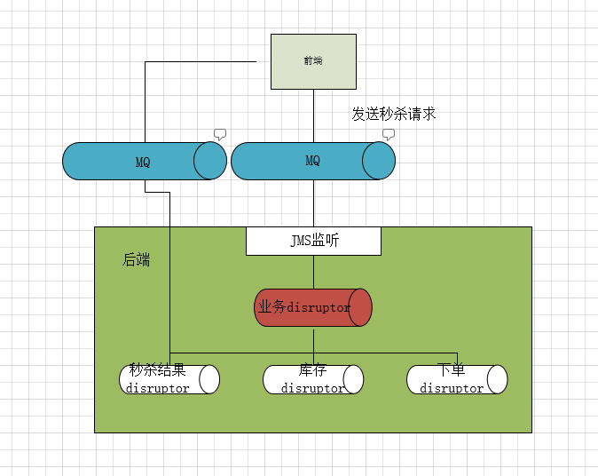

# maosha-disruptor

## 项目介绍
该项目采用disruptor作为消息队列，实现在秒杀场景下高并发下单业务。
## 秒杀下单流程
<br/>
当接受到秒杀请求之后，生成一个sql命令，然后发布CommandEvent到Disruptor队列里面。整体的数据流如下：

### 秒杀数据流
当秒杀请求到达业务disruptor队列，该队列的生产者将产生更改库存和订单生成事件。这些事件分别由
下游的库存disruptor和下单disruptor队列消费。为了提高下游队列的消费速度，更具不同的业务特点
采用批量执行sql。具体的数据流如下：
 ```java

                                                                       -------- CommandEventProducer
                                                                       -
                                                                       -------- CommandEventProducer
 -----------         ---------------          ------- Processor  ----- -
 -         -         -             -          -                        -------- CommandEventProducer
 -  Comand - ------  -  Dispatcher -  ---------                        -
 -         -         -             -          -                        -------- CommandEventProducer
 -----------         ---------------          - ------ Processor
 
 
  --------- CommandEventHandler ----- 分组缓存 CommandBuffer -----分组执行 CommandExecutor
```